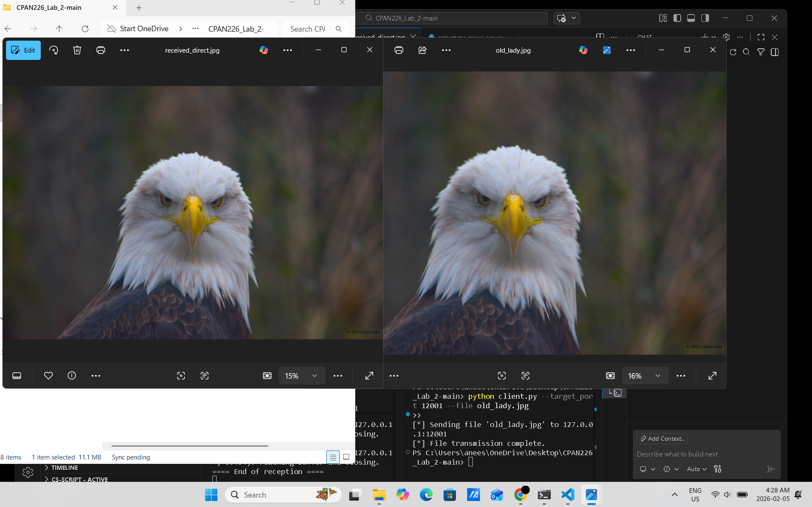
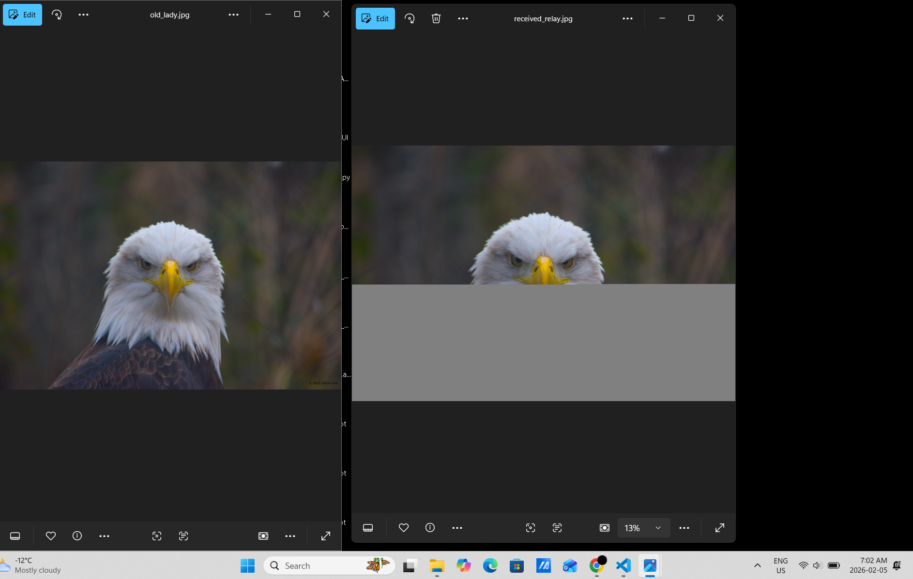
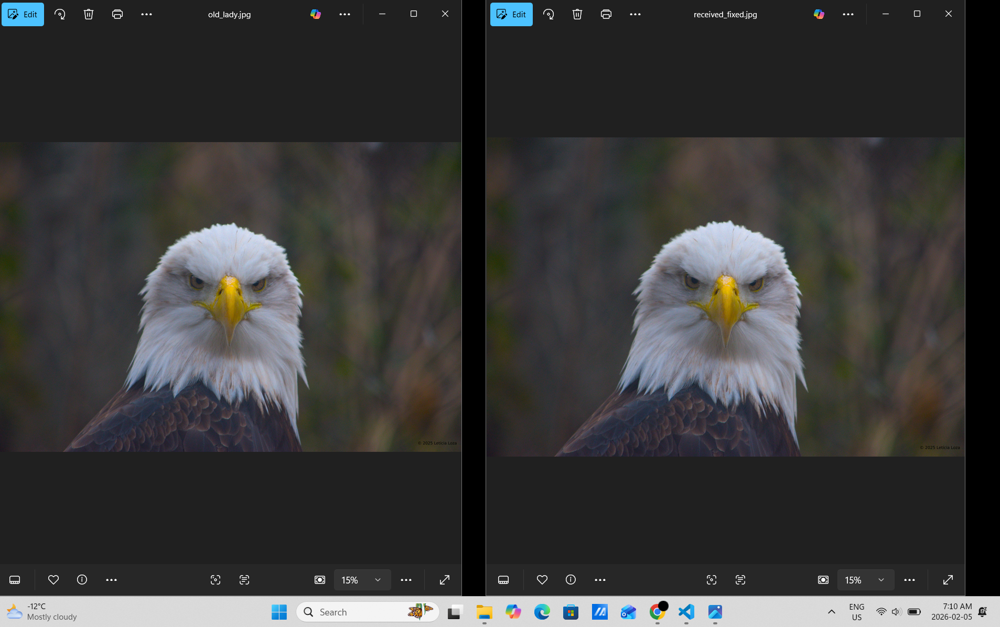
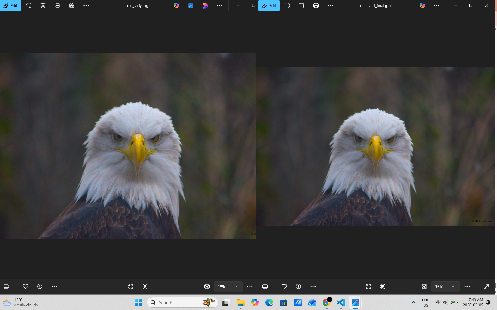

# CPAN 226 – Lab 2: UDP File Transfer Upgrade

# This program was modified by Aneesa / n01745842

---

## Student Information
Name: Aneesa  
Student ID: n01745842   

---

## Overview
In this lab, a UDP client and server were modified to reliably transfer a file even when
the network is unreliable. A relay program was used to simulate packet loss and packet
reordering. The original UDP implementation caused corrupted files because packets could
arrive out of order or be lost. The client and server were updated to handle these issues.

---

## Screenshot 1 – Direct Client to Server Transfer
This screenshot shows a direct transfer of `old_lady.jpg` from the client to the server
without using the relay. The received image matches the original image perfectly. This
confirms that the base file transfer works correctly when there is no network interference.

---

## Screenshot 2 – Broken Transfer Using Relay
This screenshot shows the result of sending the image through the relay with packet
reordering enabled and no packet loss. The received image is corrupted because packets
arrive out of order and the server writes them as they arrive.

---

## Screenshot 3 – Fixed Transfer Using Relay
After implementing reliability and sequencing logic, the image is sent through the relay
again with packet reordering enabled. The received image is no longer corrupted and matches
the original image.

---

## Screenshot 4 – Final Check (Packet Loss and Reordering)
This screenshot shows the final test using the relay with 30% packet loss and 20% packet
reordering enabled. Despite these conditions, the image is transferred successfully and
matches the original image exactly.

---

## Buffer Logic Explanation
Each packet sent by the client includes a sequence number in the packet header. The server
keeps track of the next expected sequence number. If a packet arrives out of order, it is
stored in a buffer instead of being written to the file. When the expected packet arrives,
it is written to the file and the server checks the buffer to see if additional packets can
now be written in order.

The client waits for an acknowledgement from the server after sending each packet. If an
acknowledgement is not received within a timeout period, the packet is retransmitted. This
ensures that all packets are delivered correctly even when packet loss occurs.
